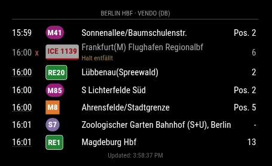

# MMM-PublicTransportHub

A [MagicMirror²](https://magicmirror.builders/) module to show public transport departures on your mirror, with broad international coverage and per-instance provider switching.

This module supports multiple providers in one place (`transitous`, `hafas`, `vendo`), so you can choose the backend that works best for each station.

Compared with earlier public transport modules that were tied to one backend, [Transitous](https://transitous.org/sources/) gives this module much broader regional coverage out of the box.

Transitous is also a community-driven open-source project, which fits well with the MagicMirror ecosystem.

## Screenshot



## Provider Comparison

|                      | Transitous                                                | HAFAS                                                                               | Vendo                        |
| -------------------- | --------------------------------------------------------- | ----------------------------------------------------------------------------------- | ---------------------------- |
| **Geographic scope** | 🌍 Global                                                 | 🌍 mostly Europe (per profile)                                                      | 🇩🇪 Germany                   |
| **Coverage model**   | Community-aggregated open data (GTFS/GTFS-RT)             | Single-operator API per profile                                                     | Deutsche Bahn official API   |
| **Profiles**         | — (one global instance)                                   | ~20 operator-specific profiles                                                      | `db`, `dbweb`                |
| **Real-time data**   | Where upstream feeds provide it                           | Yes, per operator                                                                   | Yes                          |
| **Best for**         | International or mixed regions                            | Local operators (e.g. BVG, ÖBB, SNCB)                                               | Deutsche Bahn trains/Germany |
| **Coverage details** | [transitous.org/sources](https://transitous.org/sources/) | [profile list](https://github.com/public-transport/hafas-client/tree/main/p#readme) | primarily DE, some AT/CH     |

## Choosing a Provider

Providers differ in coverage and data quality per region — no single provider is best everywhere.

- **Transitous** is a good first choice: it covers most of Europe and many regions worldwide via aggregated open GTFS feeds.
- **HAFAS** (with the right profile) often provides richer real-time data and better stop matching for specific operators.
- **Vendo** (`db`/`dbweb`) is the strongest choice for Deutsche Bahn long-distance and regional trains within Germany.

Recommendation: test all three providers for your specific station and pick the one that gives the best results locally.

Limitations/trade-offs to keep in mind:

- Providers still differ in line naming, products, and platform semantics.
- Timeout/retry is intentionally simple (fixed backoff, no circuit breaker).
- Reachability currently uses only configured `timeToStation` and departure timestamps.

## Installation

Clone this module into your MagicMirror modules directory and install dependencies:

```bash
cd ~/MagicMirror/modules
git clone https://github.com/KristjanESPERANTO/MMM-PublicTransportHub
npm ci
```

## Update

To update, pull the latest changes in the module directory:

```bash
cd ~/MagicMirror/modules/MMM-PublicTransportHub
git pull
npm ci
```

## Configuration

### Minimal Example

```js
    {
      module: "MMM-PublicTransportHub",
      position: "top_left",
      config: {
        provider: "transitous",
        stationId: "de-DELFI_de:11000:900100003",
        contact: "you@example.com",
      },
    },
```

### Full Example

```js
    {
      module: "MMM-PublicTransportHub",
      position: "top_left",
      header: "S+U Alexanderplatz Bhf",
      config: {
        provider: "transitous",
        stationId: "de-DELFI_de:11000:900100003",
        updatesEvery: 60,
        maxDepartures: 7,
        timeToStation: 4,
        maxUnreachableDepartures: 2,
        excludeCanceled: false,
        lineFilter: ["S", "U2"],
        directionFilter: ["Potsdam", "Alexanderplatz"],
        productFilter: ["subway", "suburban"],
        showDelay: false,
        showRealtimeIndicator: true,
        showRemarks: true,
        lineStylePreset: "none", // plain | none | berlin | duesseldorf | ...
        replaceInLineNames: { "Bus ": "" },
        requestTimeoutMs: 12000,
        fetchRetries: 1,
        // For Transitous, set this to a reachable email address or your MagicMirror forum alias.
        contact: "you@example.com",
      }
    },
```

### Configuration Options

| Option                     | Default        | Notes                                                                                                                                                                                             |
| -------------------------- | -------------- | ------------------------------------------------------------------------------------------------------------------------------------------------------------------------------------------------- |
| `provider`                 | `"transitous"` | Provider to use: `transitous`, `hafas`, `vendo`.                                                                                                                                                  |
| `stationId`                | `""`           | Required for all providers.                                                                                                                                                                       |
| `updatesEvery`             | `60`           | Seconds between updates. Clamped to minimum `30`.                                                                                                                                                 |
| `maxDepartures`            | `7`            | Maximum departures to render. Minimum `1`.                                                                                                                                                        |
| `animationSpeed`           | `1000`         | DOM update animation speed in ms.                                                                                                                                                                 |
| `showLastUpdate`           | `true`         | Show the last update timestamp in the module footer.                                                                                                                                              |
| `showDelay`                | `false`        | Show +/- delay minutes.                                                                                                                                                                           |
| `showRealtimeIndicator`    | `true`         | Realtime departures are subtly underlined.                                                                                                                                                        |
| `showRemarks`              | `true`         | Show warning/remark lines below departures.                                                                                                                                                       |
| `timeToStation`            | `0`            | Walking time in minutes. Minimum `0`.                                                                                                                                                             |
| `maxUnreachableDepartures` | `2`            | Maximum number of unreachable departures to keep (based on `timeToStation`). Set `0` to hide all unreachable departures. `null` means no extra limit.                                             |
| `excludeCanceled`          | `false`        | Exclude canceled departures.                                                                                                                                                                      |
| `requestTimeoutMs`         | `12000`        | Per-fetch timeout in ms. Clamped to `1000-60000`.                                                                                                                                                 |
| `fetchRetries`             | `1`            | Retry attempts after first try. Clamped to `0-5`.                                                                                                                                                 |
| `lineFilter`               | `[]`           | Only include matching lines. Accepts array or comma-separated string.                                                                                                                             |
| `directionFilter`          | `[]`           | Only include matching directions. Accepts array or comma-separated string.                                                                                                                        |
| `productFilter`            | `[]`           | Only include matching products. Accepts array or comma-separated string.                                                                                                                          |
| `replaceInDirections`      | `{}`           | String replacements before filtering/rendering directions.                                                                                                                                        |
| `replaceInLineNames`       | `{}`           | String replacements before rendering line labels.                                                                                                                                                 |
| `lineStylePreset`          | `"none"`       | `none`, `plain`, or city preset: `berlin`, `duesseldorf`, `graz`, `halle`, `hamburg`, `hannover`, `leipzig`, `magdeburg`, `munich`, `nuernberg`, `stuttgart`. Invalid values fall back to `none`. |
| `contact`                  | `""`           | Required for `provider: "transitous"`. Use a reachable email address or MagicMirror forum alias.                                                                                                  |
| `userAgent`                | `""`           | Optional custom User-Agent suffix for provider requests.                                                                                                                                          |
| `clientVersion`            | `""`           | Optional client version string sent to provider clients.                                                                                                                                          |
| `hafasProfile`             | `"db"`         | HAFAS profile when `provider: "hafas"` (for example `insa`, `vbb`).                                                                                                                               |
| `vendoProfile`             | `"db"`         | Vendo profile when `provider: "vendo"` (`db` or `dbweb`).                                                                                                                                         |
| `timeInFutureMinutes`      | `90`           | Look-ahead window in minutes for provider queries. Minimum `1`.                                                                                                                                   |
| `includeRelatedStations`   | `false`        | Include nearby/related stops if supported by the provider.                                                                                                                                        |

Note: legacy option `showColoredLineBadges` has been replaced by `lineStylePreset`.

## Station Query Helper

Use the interactive helper to find station IDs and ready-to-copy config snippets:

```bash
node --run query
```

The script asks for a station/location name, then queries Transitous, HAFAS, and Vendo. You can choose to use default profiles (HAFAS: `db`, Vendo: `db`) or specify custom ones (comma-separated for multiple profiles per provider).

Example flow:

```sh
Enter an address or station name: Leipzig Hbf
Use default profiles (HAFAS: db, Vendo: db)? (y/n): n
Enter HAFAS profile(s) (comma-separated, e.g. 'db,insa,vbb'): insa
Enter Vendo profile(s) (comma-separated, or empty for default): db
```

The script then queries all providers and prints recommended config blocks ready to copy.

## Credits

Some parts of this module are inspired by [MMM-PublicTransportHafas](https://github.com/KristjanESPERANTO/MMM-PublicTransportHafas).

## License

This project is licensed under the MIT License - see the [LICENSE](LICENSE.md) file for details.

## Changelog

All notable changes to this project will be documented in the [CHANGELOG.md](CHANGELOG.md) file.
